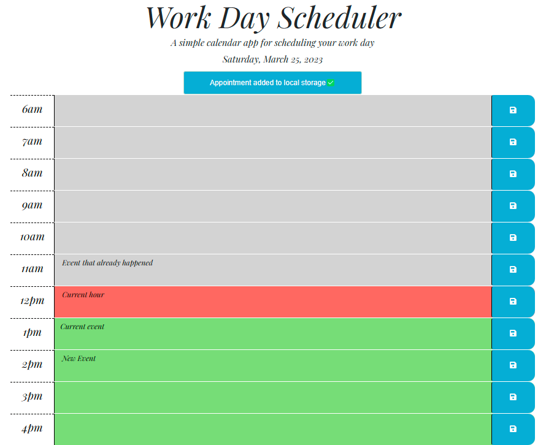

# WorkDay_Scheduler

## Notes
* Created a function that creates a single time block
* Created a function that generates time blocks based on a range
* Created a main function that determines if a time block is current, past, or    future
* Added a listen for click on save button that saves user input to local storage
* Created a function that displays an alert when a timeblock has been updated

##  Links

[Git Page](https://daniel-covington.github.io/WorkDay_Scheduler/)

[Git Hub](https://github.com/Daniel-Covington/WorkDay_Scheduler)

## Preview

The following image demonstrates the web application's appearance and functionality:

